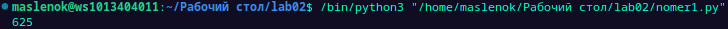
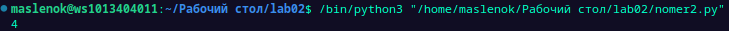
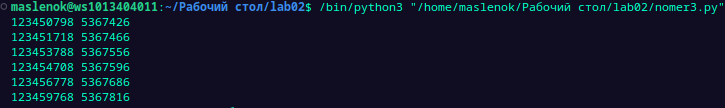

## Отчёт по лабораторной работе 2
# Вариант 8
# 1 Задание
Рассматриваются символьные последовательности длины 6  в пятибуквенном алфавите {К, А, Т, Е, Р}. Сколько существует таких последовательностей, которые начинаются с буквы Р и заканчиваются буквой К?
# Результаты вычислений:

# 2 Задание
Значение выражения $(216^6+216^4+36^6-6^9*6^5-24)$ записали в системе счисления с основанием 6. Сколько различных цифр содержит эта запись?
# Результаты вычислений:

# 3 Задание
Назовём маской числа последовательность цифр, в которой также могут встречаться следующие символы:
    - символ "?" означает ровно одну произвольную цифру;
    - символ "*" означает любую последовательность цифр произвольной длины; в том числе * может задавать и пустую последовательность.
Например, маске 123*4?5 соответствуют числа 123405 и 12365485.

Среди натуральных чисел, не превышающих $10^9$, найдите все числа, соответствующие маске 12345?7?8, делящиеся на число 23 без остатка.

Запишите в первом столбце таблицы все найденные числа в порядке возрастания, а во втором столбце  — соответствующие им результаты деления этих чисел на 23.   
# Результаты вычислений:

# Список использованных источников:
[itertools в Python - Хабр](https://habr.com/ru/companies/otus/articles/529356/)
[itertools - Functions creating iterators for efficient looping](https://docs.python.org/3/library/itertools.html)
[20 приёмов использования в Python модуля itertools](https://proglib.io/p/iteriruemsya-pravilno-20-priemov-ispolzovaniya-v-python-modulya-itertools-2020-01-03)